# Diagrama ER — HanseBeta

> **Nota `ESTADO_JUEGO`:** Por diseño explícito, esta entidad no tiene ninguna FK con el resto
> del esquema. Es el snapshot global de la partida (fecha, velocidad, dinero, modoPirata) y se
> escribe/lee de forma totalmente independiente para poder guardar sin respetar el orden de
> dependencias del resto del esquema.

> **Nota `FLOTA` vs `FLOTA_PNJ`:** Son tablas separadas por razones de migración de schema.
> Conceptualmente ambas son especializaciones de "Flota": `FLOTA` agrupa flotas del jugador y
> neutrales; `FLOTA_PNJ` almacena exclusivamente los PNJ activos en el mapamundi
> (comerciantes id 1000-1999, piratas id 2001-2999).

```mermaid
erDiagram

    %% ═══════════════════════════════════════════════════════════════════
    %% ENTIDAD GLOBAL — snapshot de partida, SIN FKs por diseño
    %% ═══════════════════════════════════════════════════════════════════

    ESTADO_JUEGO {
        int       id_estado         PK
        int       dia_juego
        int       mes_juego
        int       año_juego
        int       velocidad_tiempo
        timestamp fecha_guardado
        long      dinero_jugador
        bool      modo_pirata
    }

    %% ═══════════════════════════════════════════════════════════════════
    %% CATÁLOGOS MAESTROS — datos de referencia estáticos
    %% ═══════════════════════════════════════════════════════════════════

    CIUDAD {
        int    id_ciudad  PK
        string nombre
        int    casilla_x
        int    casilla_y
    }

    BIEN {
        int     id_bien     PK
        string  nombre
        string  categoria
        decimal precio_base
    }

    TIPO_EDIFICIO {
        int    id_tipo_edificio PK
        string nombre
    }

    TIPO_CASCO {
        int id_tipo_casco         PK
        string nombre
        int    vida_base
        int    velocidad_base
        int    maniobrabilidad_base
        int    capacidad_carga_base
    }

    %% ═══════════════════════════════════════════════════════════════════
    %% MÓDULO ECONÓMICO
    %% ═══════════════════════════════════════════════════════════════════

    %% Cadenas de producción: autorreferencia en BIEN (resultado ← ingredientes)
    RECETA_PRODUCCION {
        int id_bien_resultado    PK
        int id_bien_ingrediente  PK
        int cantidad_requerida
    }

    %% Entidad débil: estado económico de cada bien en cada ciudad
    ESTADO_MERCADO_CIUDAD {
        int     id_ciudad     PK
        int     id_bien       PK
        int     stock
        int     produccion
        int     consumo
        decimal precio_actual
    }

    %% Entidad débil: cantidad de edificios de cada tipo por ciudad
    EDIFICIOS_CIUDAD {
        int id_ciudad        PK
        int id_tipo_edificio PK
        int cantidad
    }

    %% Inventario personal del jugador (bodega global, una fila por bien)
    ALMACEN_JUGADOR {
        int id_bien  PK
        int cantidad
    }

    %% Depósito del jugador en cada ciudad (sin FKs formales en BD)
    ALMACEN_CIUDAD_JUGADOR {
        int id_ciudad PK
        int id_bien   PK
        int cantidad
    }

    %% ═══════════════════════════════════════════════════════════════════
    %% MÓDULO FLOTAS Y NAVEGACIÓN
    %% ═══════════════════════════════════════════════════════════════════

    CAPITAN {
        int    id_capitan           PK
        string nombre
        bool   asignado
        float  habilidad_navegacion
        float  habilidad_combate
        int    id_barco_asignado
    }

    FLOTA {
        int    id_flota          PK
        string tipo_propietario
        int    id_ciudad_actual  FK
        float  posicion_x
        float  posicion_y
        int    id_capitan        FK
        string estado_actual
        int    id_ciudad_destino FK
        float  posicion_actual_x
        float  posicion_actual_y
        int    casilla_destino_x
        int    casilla_destino_y
    }

    BARCO {
        int    id_barco              PK
        int    id_tipo_casco         FK
        string nombre_barco
        bool   es_barco_combate
        int    vida_actual
        int    tripulacion_actual
        int    capacidad_tripulacion
        int    id_flota              FK
    }

    %% Entidad débil: módulos de equipamiento instalados en un barco
    MODULO_BARCO {
        int    id_modulo_barco PK
        int    id_barco        FK
        string tipo_modulo
        string nombre_modulo
        int    valor_a
        int    valor_b
    }

    %% Entidad débil: vida de cada sección estructural del barco (PK compuesta)
    ESTADO_SECCION_BARCO {
        int    id_barco    PK
        string seccion     PK
        int    vida_seccion
    }

    %% Tabla de relación M:N entre BARCO y BIEN (bodega del barco)
    CARGA_BARCO {
        int id_barco PK
        int id_bien  PK
        int cantidad
    }

    %% ═══════════════════════════════════════════════════════════════════
    %% MÓDULO PNJ
    %% ═══════════════════════════════════════════════════════════════════

    %% Memoria de mercado — precio conocido caduca tras 7 días de juego
    MEMORIA_COMERCIAL_PNJ {
        int     id_flota           PK
        int     id_bien            PK
        int     id_ciudad          PK
        decimal precio_conocido
        int     dia_juego_conocido
    }

    %% Flotas PNJ — tabla separada para evitar conflictos de schema con FLOTA
    FLOTA_PNJ {
        int    id                 PK
        string nombre_propietario
        int    ciudad_origen_id
        int    ciudad_destino_id
        string estado
        float  posicion_actual_x
        float  posicion_actual_y
        int    casilla_destino_x
        int    casilla_destino_y
        int    casilla_destino_z
    }

    %% Tabla de relación M:N entre FLOTA_PNJ y BIEN (bodega del PNJ)
    CARGA_FLOTA_PNJ {
        int id_flota PK
        int id_bien  PK
        int cantidad
    }

    %% ═══════════════════════════════════════════════════════════════════
    %% RELACIONES
    %% ═══════════════════════════════════════════════════════════════════

    %% ── Módulo Económico ────────────────────────────────────────────────

    %% Cadenas de producción: BIEN se autorreferencia en dos roles distintos
    BIEN ||--o{ RECETA_PRODUCCION : "es resultado de"
    BIEN ||--o{ RECETA_PRODUCCION : "es ingrediente en"

    %% Estado de mercado: cada bien tiene precio y stock por ciudad
    CIUDAD ||--o{ ESTADO_MERCADO_CIUDAD : "tiene mercado de"
    BIEN   ||--o{ ESTADO_MERCADO_CIUDAD : "se cotiza en"

    %% Edificios de producción de cada ciudad
    CIUDAD        ||--o{ EDIFICIOS_CIUDAD : "alberga"
    TIPO_EDIFICIO ||--o{ EDIFICIOS_CIUDAD : "tipifica"

    %% Inventario del jugador
    BIEN ||--o{ ALMACEN_JUGADOR : "almacenado en bodega"

    %% Depósito por ciudad del jugador (relación lógica; sin FK formal en BD)
    CIUDAD ||--o{ ALMACEN_CIUDAD_JUGADOR : "custodia depósito"
    BIEN   ||--o{ ALMACEN_CIUDAD_JUGADOR : "depositado en ciudad"

    %% ── Módulo Flotas y Barcos ──────────────────────────────────────────

    %% Una ciudad puede ser el puerto actual de muchas flotas
    CIUDAD ||--o{ FLOTA : "es puerto actual de"

    %% Una ciudad puede ser destino activo de muchas flotas
    CIUDAD ||--o{ FLOTA : "es destino de"

    %% Un capitán puede comandar varias flotas (nullable → 0..1 por flota)
    CAPITAN |o--o{ FLOTA : "comanda"

    %% Una flota agrupa varios barcos
    FLOTA ||--o{ BARCO : "agrupa"

    %% El tipo de casco define los atributos base del barco
    TIPO_CASCO ||--o{ BARCO : "define estructura de"

    %% Un barco equipa varios módulos de mejora
    BARCO ||--o{ MODULO_BARCO : "equipa"

    %% Un barco tiene secciones estructurales con vida propia
    BARCO ||--o{ ESTADO_SECCION_BARCO : "tiene secciones"

    %% Un barco transporta varios bienes en bodega (M:N resuelta)
    BARCO ||--o{ CARGA_BARCO : "lleva en bodega"
    BIEN  ||--o{ CARGA_BARCO : "embarcado como"

    %% Asignación lógica capitán → barco concreto (sin FK formal en BD)
    CAPITAN }o--|| BARCO : "asignado a"

    %% ── Módulo PNJ ──────────────────────────────────────────────────────

    %% Memoria comercial de las flotas jugador/PNJ (relación lógica; sin FK formal)
    FLOTA  ||--o{ MEMORIA_COMERCIAL_PNJ : "memoriza precio de"
    BIEN   ||--o{ MEMORIA_COMERCIAL_PNJ : "precio conocido"
    CIUDAD ||--o{ MEMORIA_COMERCIAL_PNJ : "precio observado en"

    %% Carga de flotas PNJ (M:N resuelta con tabla intermedia)
    FLOTA_PNJ ||--o{ CARGA_FLOTA_PNJ : "transporta"
    BIEN      ||--o{ CARGA_FLOTA_PNJ  : "cargado en PNJ"
```

---

## Análisis de entidades

### Inventario completo de tablas (19 entidades)

| Entidad | Tipo | PK | FKs formales |
|---|---|---|---|
| `ESTADO_JUEGO` | Entidad independiente | `id_estado` | — (ninguna por diseño) |
| `CIUDAD` | Catálogo maestro | `id_ciudad` | — |
| `BIEN` | Catálogo maestro | `id_bien` | — |
| `TIPO_EDIFICIO` | Catálogo maestro | `id_tipo_edificio` | — |
| `TIPO_CASCO` | Catálogo maestro | `id_tipo_casco` | — |
| `CAPITAN` | Entidad | `id_capitan` | `id_barco_asignado` (lógica, no formal) |
| `FLOTA` | Entidad | `id_flota` | `id_ciudad_actual`, `id_ciudad_destino`, `id_capitan` |
| `BARCO` | Entidad débil | `id_barco` | `id_tipo_casco`, `id_flota` |
| `RECETA_PRODUCCION` | Relación M:N (auto) | `(id_bien_resultado, id_bien_ingrediente)` | ambas → `BIEN` |
| `ESTADO_MERCADO_CIUDAD` | Entidad débil | `(id_ciudad, id_bien)` | → `CIUDAD`, → `BIEN` |
| `EDIFICIOS_CIUDAD` | Entidad débil | `(id_ciudad, id_tipo_edificio)` | → `CIUDAD`, → `TIPO_EDIFICIO` |
| `ALMACEN_JUGADOR` | Entidad débil | `id_bien` | → `BIEN` |
| `ALMACEN_CIUDAD_JUGADOR` | Entidad débil | `(id_ciudad, id_bien)` | — (lógicas sin FK formal) |
| `MODULO_BARCO` | Entidad débil | `id_modulo_barco` | → `BARCO` |
| `ESTADO_SECCION_BARCO` | Entidad débil | `(id_barco, seccion)` | → `BARCO` |
| `CARGA_BARCO` | Relación M:N | `(id_barco, id_bien)` | → `BARCO`, → `BIEN` |
| `MEMORIA_COMERCIAL_PNJ` | Entidad débil | `(id_flota, id_bien, id_ciudad)` | — (lógicas sin FK formal) |
| `FLOTA_PNJ` | Entidad | `id` | — (ciudades referenciadas sin FK) |
| `CARGA_FLOTA_PNJ` | Relación M:N | `(id_flota, id_bien)` | → `FLOTA_PNJ` |

### Entidades débiles (dependen de otra para existir)

| Entidad débil | Entidad(es) propietaria(s) |
|---|---|
| `RECETA_PRODUCCION` | `BIEN` (doble rol: resultado e ingrediente) |
| `ESTADO_MERCADO_CIUDAD` | `CIUDAD` + `BIEN` |
| `EDIFICIOS_CIUDAD` | `CIUDAD` + `TIPO_EDIFICIO` |
| `ALMACEN_JUGADOR` | `BIEN` |
| `ALMACEN_CIUDAD_JUGADOR` | `CIUDAD` + `BIEN` (lógico) |
| `BARCO` | `FLOTA` + `TIPO_CASCO` |
| `MODULO_BARCO` | `BARCO` |
| `ESTADO_SECCION_BARCO` | `BARCO` |
| `CARGA_BARCO` | `BARCO` + `BIEN` |
| `MEMORIA_COMERCIAL_PNJ` | `FLOTA` + `BIEN` + `CIUDAD` (lógico) |
| `CARGA_FLOTA_PNJ` | `FLOTA_PNJ` |

### Especializaciones y jerarquías

| Entidad | Atributo discriminante | Valores posibles |
|---|---|---|
| `FLOTA` | `tipo_propietario` | `'jugador'` / `'comerciante'` / `'pirata'` / `'neutral'` |
| `FLOTA` | `estado_actual` | `'EnPuerto'` / `'Navegando'` / `'EnCombate'` / `'Huyendo'` |
| `FLOTA_PNJ` | `estado` | `'EnPuerto'` / `'Navegando'` / `'Comerciando'` |
| `BIEN` | `categoria` | `'primario'` / `'intermedio'` / `'avanzado'` |
| `MODULO_BARCO` | `tipo_modulo` | `'armamento'` / `'velas'` / `'bodega'` |
| `ESTADO_SECCION_BARCO` | `seccion` | `'timon'` / `'velas'` / `'armamento'` / `'flotacion'` |

### Relaciones de cardinalidad

| Relación | Cardinalidad | Notas |
|---|---|---|
| `CIUDAD` → `ESTADO_MERCADO_CIUDAD` | 1:M | Una ciudad tiene un registro por bien |
| `BIEN` → `ESTADO_MERCADO_CIUDAD` | 1:M | Un bien cotiza en varias ciudades |
| `CIUDAD` → `EDIFICIOS_CIUDAD` | 1:M | Una ciudad tiene varios tipos de edificio |
| `TIPO_EDIFICIO` → `EDIFICIOS_CIUDAD` | 1:M | Un tipo aparece en varias ciudades |
| `BIEN` → `RECETA_PRODUCCION` (resultado) | 1:M | Un bien puede ser resultado de varias recetas |
| `BIEN` → `RECETA_PRODUCCION` (ingrediente) | 1:M | Un bien puede ser ingrediente en varias recetas |
| `BIEN` → `ALMACEN_JUGADOR` | 1:1 | Un bien tiene como máximo una fila en el almacén |
| `CIUDAD` → `ALMACEN_CIUDAD_JUGADOR` | 1:M | Una ciudad puede tener varios bienes en depósito |
| `BIEN` → `ALMACEN_CIUDAD_JUGADOR` | 1:M | Un bien puede estar depositado en varias ciudades |
| `CAPITAN` → `FLOTA` | 1:M (nullable) | Un capitán puede comandar varias flotas históricas; cada flota tiene 0..1 capitán |
| `CIUDAD` → `FLOTA` (puerto actual) | 1:M (nullable) | Una ciudad puede acoger varias flotas |
| `CIUDAD` → `FLOTA` (destino) | 1:M (nullable) | Una ciudad puede ser destino de varias flotas |
| `FLOTA` → `BARCO` | 1:M | Una flota agrupa varios barcos |
| `TIPO_CASCO` → `BARCO` | 1:M | Un tipo de casco define varios barcos |
| `CAPITAN` → `BARCO` | M:1 (lógica) | Un capitán se asigna a un barco concreto |
| `BARCO` → `MODULO_BARCO` | 1:M | Un barco equipa varios módulos |
| `BARCO` → `ESTADO_SECCION_BARCO` | 1:M | Un barco tiene varias secciones estructurales |
| `BARCO` ↔ `BIEN` (via `CARGA_BARCO`) | M:N | Varios barcos transportan varios bienes |
| `FLOTA` → `MEMORIA_COMERCIAL_PNJ` | 1:M (lógica) | Una flota acumula varios recuerdos de precios |
| `FLOTA_PNJ` ↔ `BIEN` (via `CARGA_FLOTA_PNJ`) | M:N | Varias flotas PNJ transportan varios bienes |
